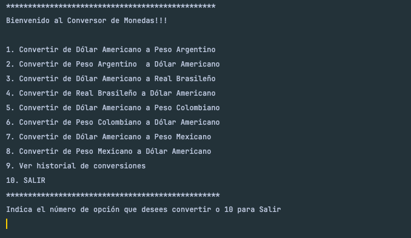
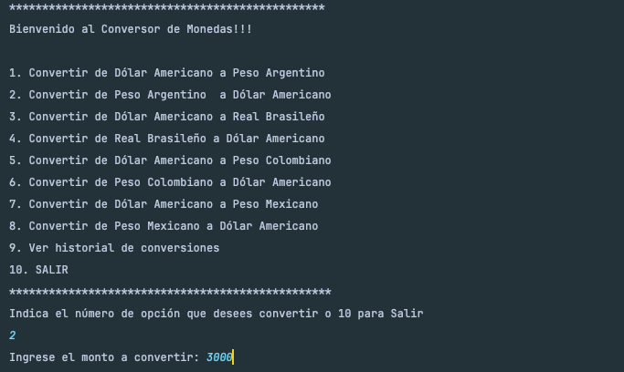
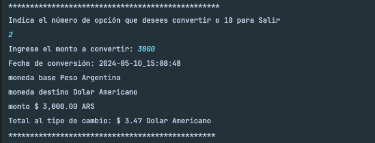
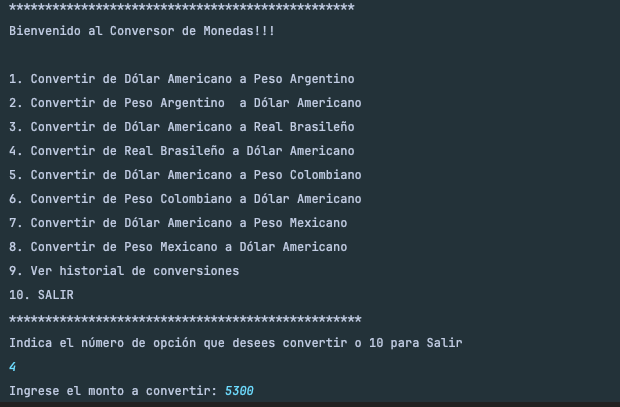
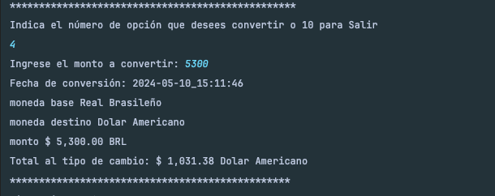
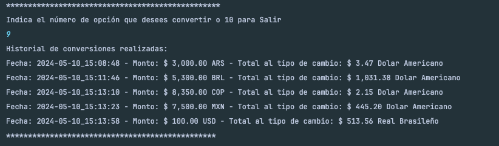
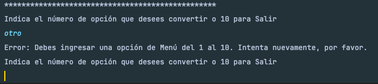
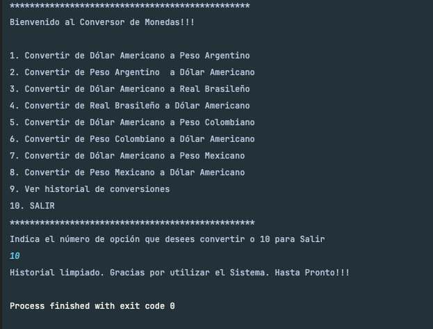

# Conversor de Monedas - Java

## Descripción

Este proyecto permite al usuario realizar la conversión de monedas al tipo de cambio actualizado a la fecha, según las opciones propuestas en Menú.
Así mismo el usuario podrá solicitar se le muestre un historial con los tipos de cambio consultados.

El sistema:
- Muestra un menú con opciones de conversión de monedas.
- Obtiene los valores actualizados, del tipo de cambio,  de las monedas desde la API externa.
- Realiza la conversión de monedas previamente seleccionada por el usuario.
- Mantiene un historial de las conversiones realizadas, el cual puede ser consultado por el usuario, si así lo desea.

## Tecnologías Utilizadas

- Mac Os 
- Intellij IDEA ver. 2024.1.1 
- JDK de Java 21.0.2 
- Biblioteca Gson 2.10.1
- ExchangeRate-API

    #### Notas:
    El sistema realiza una busqueda de los valores del tipo de cambio a través de una API externa.
    los cuales son instanciados a un gson, con el cual se manejan los datos para mostrar la conversión del tipo de cambio.
    Toda ves hecho lo anterior se van guardando las conversiones en un ArrayList para crear el historial de dichas conversiones. 
    Dicho historico solo es temporal, mientras el usuario permenece en el sistema y va realizando conversiones.
    Por otro lado se da formato de Fecha y moneda a las variables de los valores obtenidos, esto para que el usuario tenga un mejor experiencia visual de la información que se le presenta.
    En cuanto al menejo de errores, entre otros y no menos importante es cuando el usuario intenta ingresar un valor fuera de los contenidos en el menú. Indicandole al usuario de dicho error y permitiendo que siga con la conversión de otras monedas.

## Demostración del Sistema

Menú de inicio al sistema.

Selección del Usuario, de moneda a convertir.

Resultado de la conversión seleccionada.

Segunda Conversion del usuario.

Resultado de la segunda Conversión.

Consulta al histórica de Conversiones.

Error al intentar ingresar un valor fuera del menú.

Salida y fin del sistema

## Estado del Proyecto

El proyecto se encuentra en su versión 1.0.0.

## Acceso al Proyecto

Puedes acceder al proyecto y obtener el código fuente desde su repositorio en [GitHub Conversor de monedas en Java](https://github.com/MAValerdi/Conversor-monedas-java).

## Instrucciones de Uso

1. Clona el repositorio desde GitHub.
2. Asegurate que el proyecto este en alguna ubicación en tu equipo local.
3. Importa el proyecto desde tu IDE Intellij IDEA o el IDE de tu preferencia.
4. Ejecuta la aplicación y sigue las instrucciones en pantalla.

## Autor
Mario Alberto Valerdi Garduño
[Linkedin Mario Valerdi](www.linkedin.com/in/mariovalerdi).

#### Anotaciones finales:
Challenge "CONVERSOR DE MONEDAS".
Del curso Java Orientado a Objetos
de ALURA Latam, Oracle ONE G6
